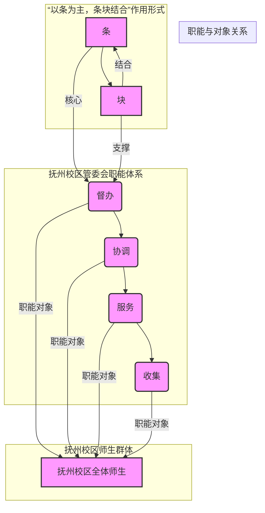

```mermaid
graph TD
    subgraph "抚州校区管委会职能体系"
        direction TB
        A(督办) --> B(协调)
        B --> C(服务)
        C --> D(收集)
    end

    subgraph "抚州校区师生群体"
        direction LR
        E[抚州校区全体师生]
    end

    subgraph "职能与对象关系"
        style A fill:#f9f,stroke:#333,stroke-width:2px;
        style B fill:#f9f,stroke:#333,stroke-width:2px;
        style C fill:#f9f,stroke:#333,stroke-width:2px;
        style D fill:#f9f,stroke:#333,stroke-width:2px;
        style E fill:#f9f,stroke:#333,stroke-width:2px;

        A -- 职能对象 --> E
        B -- 职能对象 --> E
        C -- 职能对象 --> E
        D -- 职能对象 --> E
    end

    subgraph "“以条为主，条块结合”作用形式"
        F[条] --> G[块]
        G -- 结合 --> F
    end

    style F fill:#f9f,stroke:#333,stroke-width:2px;
    style G fill:#f9f,stroke:#333,stroke-width:2px;

    F -- 核心 --> A
    G -- 支撑 --> A
```